# Banner Bot

Automated banner generation for the Everstake marketing team. Renders 1600×900 PNG banners from 21 predefined templates via a Slack slash command.

## Slack flow

```
/banner
   │
   ▼
┌──────────────────────────────────────┐
│  Step 1 — Template gallery           │
│  21 templates, each with a preview   │
│  image and a "Use this template"     │
│  button.                             │
└──────────────────────────────────────┘
   │ (user picks one)
   ▼
┌──────────────────────────────────────┐
│  Step 2 — Banner details             │
│   • selected template preview        │
│   • only the inputs the chosen       │
│     template actually uses (title,   │
│     subtitle, date, …)               │
│   • partner-logo gallery, sized to   │
│     the template's slot count (0/1/  │
│     2/3 logos)                       │
│   • Generate                         │
└──────────────────────────────────────┘
   │ (Generate)
   ▼
Requester's channel:  (only the requester sees this — ephemeral)
   "⏳ Submitted to @approver for design review. Final file will
    appear here once approved."

Approver's DM with the bot:
   ├─ banner-preview.png    (downscaled thumbnail only)
   └─ [ Approve ]  [ Reject ]

   ── on Approve ─→  Requester's channel:
                        "🎉 @user your approved banner is ready — <Template>."
                        ⤷ banner.png (full resolution, uploaded as a file)

   ── on Reject  ─→  Requester's channel:
                        "❌ Your banner was rejected by @approver."  (ephemeral)
```

Each preview entry pins its own theme (Light / Dark) and any required variant via `defaults`/`variant` in `src/templates/preview-list.js`, so the user is never asked to pick a theme manually. Approval is gated on `APPROVER_USER_ID`: the approver receives the preview privately in a DM with the bot, and only their click on Approve / Reject is honored. The requester's channel stays clean until the final file is delivered (or the rejection notice fires, which only they see).

## Templates

(Each template number below is what users pick from the Step 1 gallery.)

| # | Name | # | Name |
|---|---|---|---|
| 1 | Text in Center — Dark v1 | 12 | Centered Logo + Title |
| 2 | Text in Center — Light v2 | 13 | Dark Full |
| 3 | Text in Center — Dark v3 | 14 | Collaboration 3 Companies (Light) |
| 4 | Text in Center — Dark v4 | 15 | Collaboration 3 Companies (Dark) |
| 5 | Week in Blockchains | 16 | Guide / Tutorial |
| 6 | APR | 17 | Dark Partner Left |
| 7 | Collaboration | 18 | Dark Text Left + Icon Right |
| 8 | About Blockchain v1 | 19 | Dark Guide |
| 9 | About Blockchain v2 | 20 | Collaboration 2 Companies |
| 10 | Dark Left Panel | 21 | Wide Dark + 2 Logos |
| 11 | Dark Right Panel | | |

Preview thumbnails live in `docs/previews/template-N.png` and are regenerated by `npm run preview`.

## Tech stack

- **Node.js 20+** — runtime
- **Puppeteer** — renders HTML/CSS templates to PNG 1600×900
- **Slack Bolt** — Slack bot framework (Socket Mode)
- **Zalando Sans** — custom font (included in `assets/fonts/`)

## Local setup

### 1. Install dependencies

```bash
npm install
```

### 2. Configure environment

```bash
cp .env.example .env
```

Fill in the Slack tokens. For local dev, `PUBLIC_BASE_URL` must point at a public HTTPS tunnel into your machine (e.g. `cloudflared tunnel --url http://localhost:3000`) — Slack downloads preview images from this URL.

### 3. Add partner logos

Place PNG/SVG files in `assets/logos/`. Files matching `bg-*`, `pattern-*`, `everstake-*`, or `week-icons*` are automatically excluded from the picker (they are template assets, not partner logos).

### 4. Generate previews

```bash
npm run preview
```

This renders all 21 templates into `docs/previews/template-N.png`.

### 5. Run

```bash
npm start
```

The bot opens a WebSocket to Slack (Socket Mode) **and** an HTTP listener on `PORT` for serving preview images. Use `/banner` in any channel where the app is installed.

## Deploy to Railway

### Prerequisites

- A Railway account
- A Slack app already configured with:
  - Socket Mode enabled
  - `commands` scope and the `/banner` slash command registered
  - `chat:write`, `files:write`, `reactions:write`, `im:write` bot scopes
  - `app_mentions:read` event subscription (optional)

> **Note on `im:write`:** the bot opens a DM with the approver to send them the
> preview privately. Without this scope, `client.conversations.open` will fail
> and `/banner` submissions won't go anywhere.

### Steps

1. **Push the repo to GitHub.**

2. **Create a new Railway service** from your GitHub repo. Railway will detect the `Dockerfile` (and `railway.json`) and use it for the build — Chromium and all Puppeteer system libs are baked in.

3. **Generate a public domain** for the service: Settings → Networking → Generate Domain. Railway exposes this domain as the env var `RAILWAY_PUBLIC_DOMAIN`, which the bot picks up automatically — no need to copy/paste it.

4. **Set environment variables** in the Railway dashboard:

   ```
   SLACK_BOT_TOKEN=xoxb-…
   SLACK_SIGNING_SECRET=…
   SLACK_APP_TOKEN=xapp-…
   APPROVER_NAME=Maksym Kunytsia
   APPROVER_USER_ID=U07XXXXXX        # Slack ID of the approver
   ```

   `APPROVER_USER_ID` gates the "Approved by …" button — only that exact user can click it; everyone else gets an ephemeral rejection. Find it in Slack: profile → ⋮ More → Copy member ID. If left empty, the button fails closed (nobody can approve).

   Do **not** set `PORT` — Railway injects it. Do not set `PUBLIC_BASE_URL` either; the bot derives it from `RAILWAY_PUBLIC_DOMAIN`. (If you have a custom domain, set `PUBLIC_BASE_URL=https://your.domain` to override.)

5. **Deploy.** Railway will build the Docker image (~2 min on first build, then cached) and start the bot. Logs should show:

   ```
   [static-server] listening on :PORT
   [static-server] public base URL: https://your-service.up.railway.app
   ⚡ Banner Bot is running!
   ```

6. **Health check.** Railway pings `/healthz` (configured in `railway.json`). It returns `200 OK` once the HTTP server is up.

### Operational notes

- The container runs as the unprivileged `node` user with `tini` as PID 1, so Chromium child processes get reaped properly on redeploy/SIGTERM.
- Logo PNG previews are rasterized lazily on first request and cached at `/app/output/logo-previews/`. The cache is rebuilt fresh each deploy (the volume is ephemeral) — that's fine, warmup re-runs in the background on startup.
- The Puppeteer browser instance is shared across banner generation **and** logo rasterization, so memory stays bounded (~250 MB steady state).

## Project structure

```
banner-bot/
├── src/
│   ├── app.js                    # entry point — boots Bolt + static server
│   ├── renderer.js               # Puppeteer HTML→PNG renderer
│   ├── generate-previews.js      # CLI: render all 21 preview thumbnails
│   ├── presentation.js           # presentation slide generator (legacy)
│   ├── lib/
│   │   ├── static-server.js      # public HTTP server for previews & logos
│   │   └── logo-previews.js      # SVG → PNG rasterizer with disk cache
│   ├── templates/
│   │   ├── templates.js          # all 21 template renderers + listLogos()
│   │   └── preview-list.js       # template id ↔ preview number mapping
│   └── slack/
│       └── interactions.js       # /banner flow + approve button
├── assets/
│   ├── fonts/                    # Zalando Sans (.ttf)
│   └── logos/                    # partner logos, backgrounds, patterns
├── docs/
│   └── previews/                 # template-1.png … template-21.png
├── output/                       # gitignored — generated banners + cache
├── Dockerfile                    # Debian + Chromium + tini
├── railway.json                  # Railway build/deploy config
├── .dockerignore
├── .env.example
├── package.json
└── README.md
```

## Design system

| Token | Value |
|-------|-------|
| Light background | `#f5fffd` |
| Dark background | `linear-gradient(to top right, #034638 75%, #012d24 100%)` |
| Text on light | `#034638` |
| Text on dark | `#f5fffd` |
| Accent | `#40c1ac` |
| Muted text | `#7b9690` |
| Grid lines (light) | `#dee8e6` |
| Grid lines (dark) | `#55857b` |
| Font | Zalando Sans (200, 300, 400, 500) |
| Partner logo color | `#034638` |
| Gradient blob | `rgba(64,193,172,0.40)` to `rgba(130,230,180,1.0)` |
| Right panel gradient | `rgba(64,193,172,0.20)` to `rgba(123,150,144,0.50)` |

## Template previews

### Template 1 — Text in Center (Dark, green + yellow)
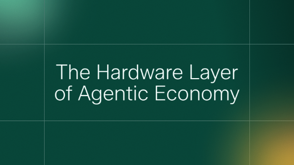

### Template 2 — Text in Center (Light, green + orange)
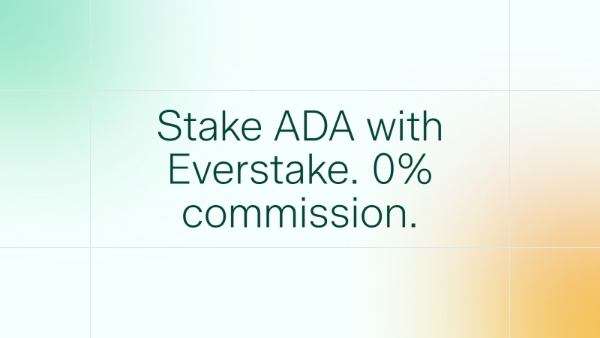

### Template 3 — Text in Center (Dark, green + teal)
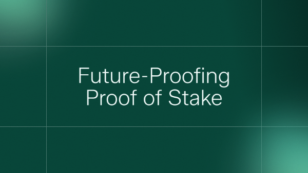

### Template 4 — Text in Center (Dark, yellow bottom)
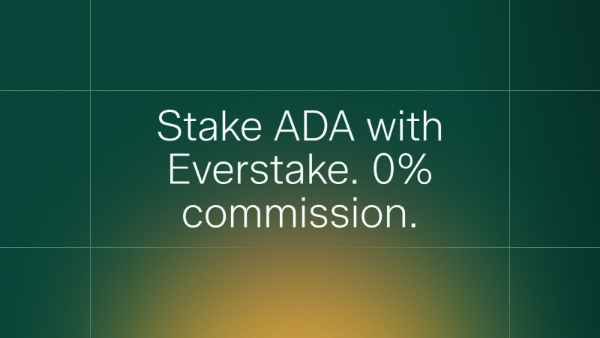

### Template 5 — Week in Blockchains
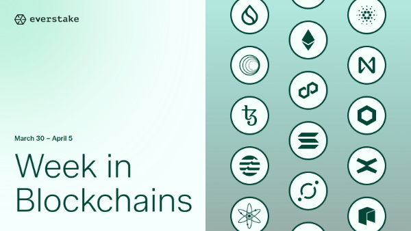

### Template 6 — APR
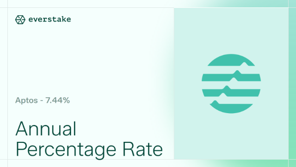

### Template 7 — Collaboration
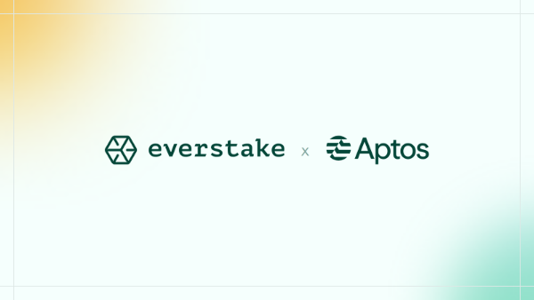

### Template 8 — About Blockchain v1
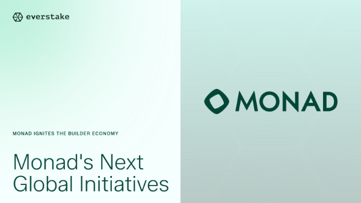

### Template 9 — About Blockchain v2
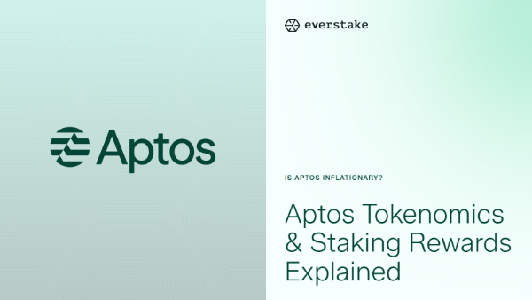

### Template 10 — Dark Left Panel
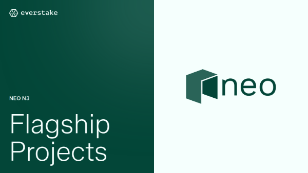

### Template 11 — Dark Right Panel
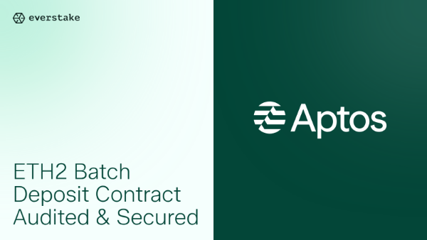

### Template 12 — Centered Logo + Title
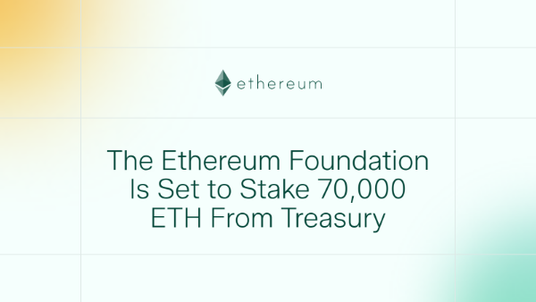

### Template 13 — Dark Full
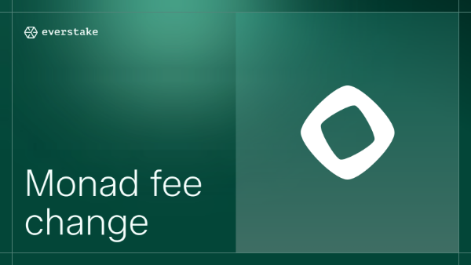

### Template 14 — Collaboration 3 Companies (Light)
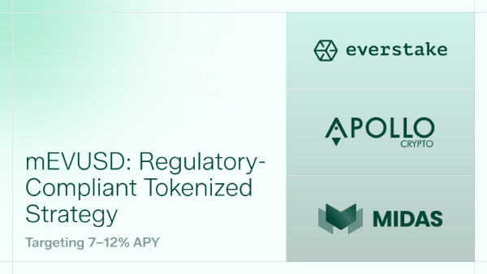

### Template 15 — Collaboration 3 Companies (Dark)
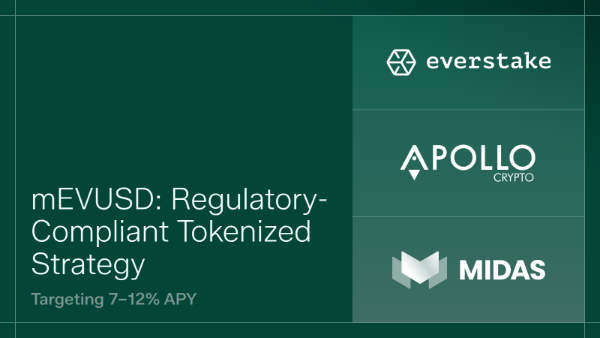

### Template 16 — Guide / Tutorial
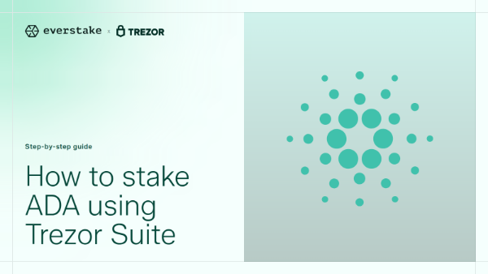

### Template 17 — Dark Partner Left
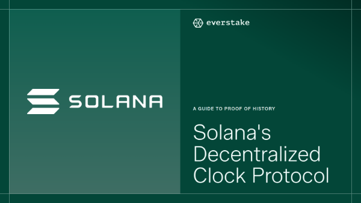

### Template 18 — Dark Text Left + Icon Right
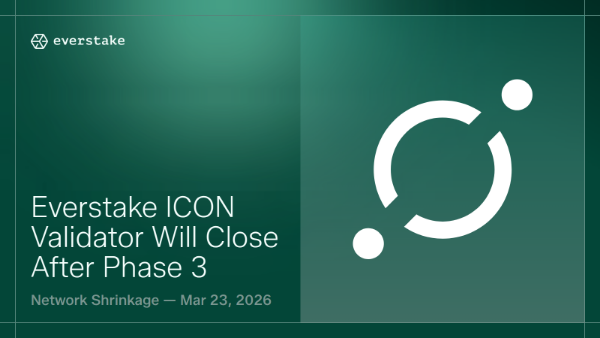

### Template 19 — Dark Guide
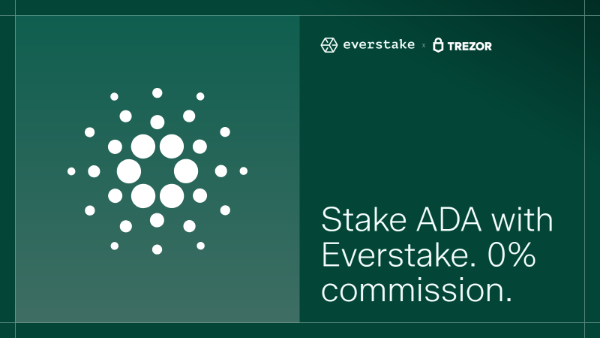

### Template 20 — Collaboration 2 Companies
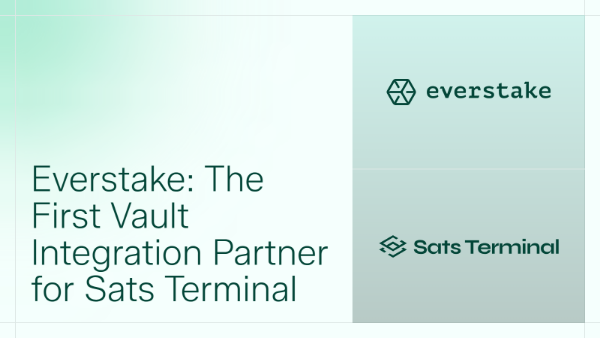

### Template 21 — Wide Dark + 2 Logos
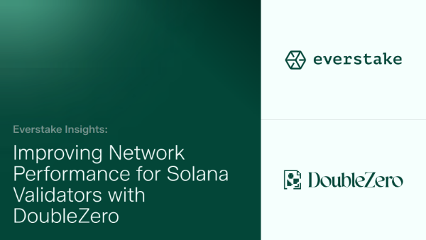
